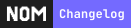

# Nom

A social feed for your project's activities on Github.

## Features

- Real-time social feed of your project's GitHub activities (issues, PRs, releases, comments, etc.)
- Share and subscribe repositories
- Highly customizable AI prompt for feed generation ([see example](.nom/pull_request_summary_template.txt))

## Built with

- [Next.js](https://nextjs.org/) - Highly performant React framework
- [shadcn/ui](https://ui.shadcn.com/) - UI component library
- [Supabase](https://supabase.com/) - Open source BaaS
- [Trigger.dev](https://trigger.dev/) - Open source background jobs management
- [Tanstack Query](https://tanstack.com/query/latest) - Data fetching and caching for React
- [Zod](https://zod.dev/) - TypeScript-first schema validation
- [OpenAI](https://openai.com/) - Summarize context for feed content

## Local development

See [CONTRIBUTING.md](CONTRIBUTING.md) for more information about setting up locally.

## Contributing

We welcome contributions! Please open issues or pull requests for any improvements, bug fixes, or suggestions.

For detailed guidelines, please check out our [CONTRIBUTING.md](./CONTRIBUTING.md) document.
